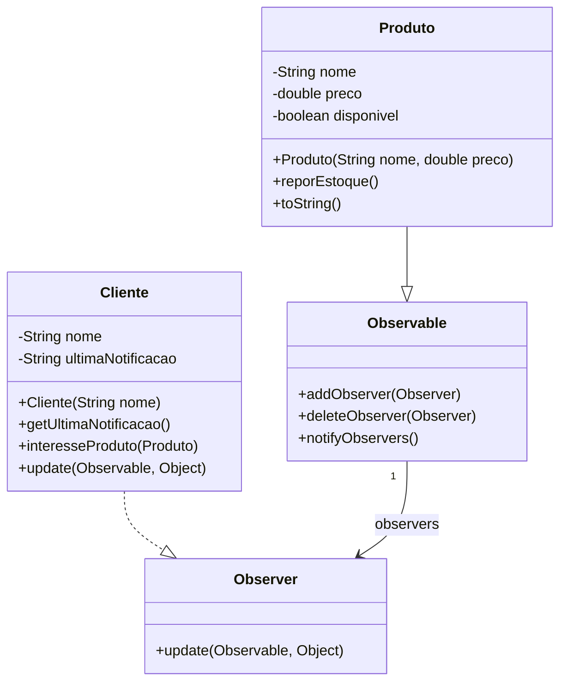

# Pattern-Observer

## Descrição do Padrão

O padrão Observer implementado neste exemplo demonstra um sistema de notificação de disponibilidade de produtos. Quando um produto volta ao estoque, todos os clientes interessados são notificados automaticamente.

### Componentes:
- **Observable (Produto)**: O objeto que mantém uma lista de observadores e os notifica sobre mudanças
- **Observer (Cliente)**: O objeto que deseja ser notificado sobre mudanças no Observable

### Funcionamento:
1. Clientes podem registrar interesse em produtos específicos
2. Quando o produto volta ao estoque, todos os clientes interessados são notificados
3. Cada cliente recebe uma mensagem personalizada sobre a disponibilidade do produto

## Diagrama de Classes

## 👥 Autor
Luis Gustavo Theml Novais e Marciana Pereira